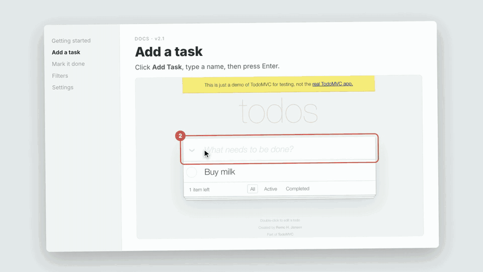
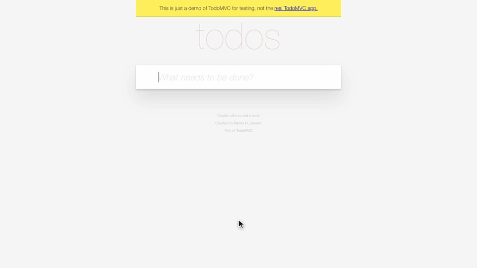
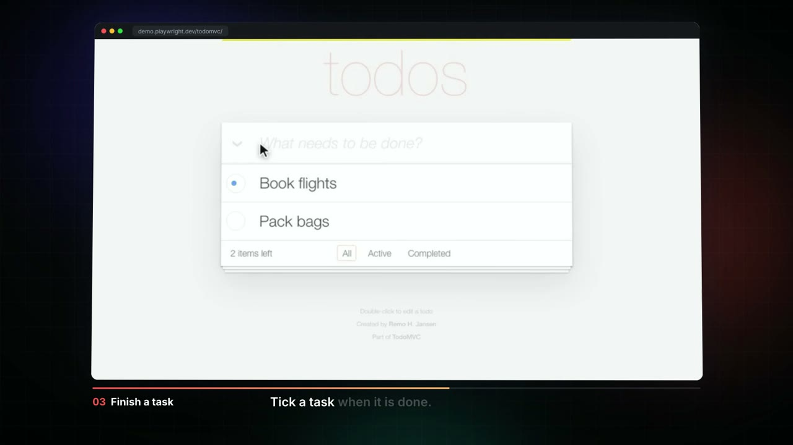
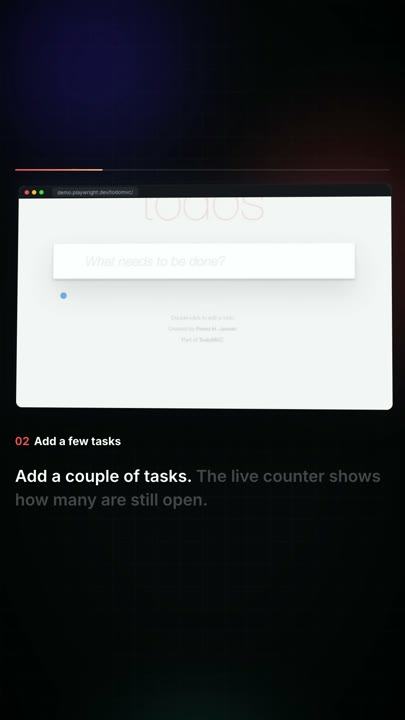
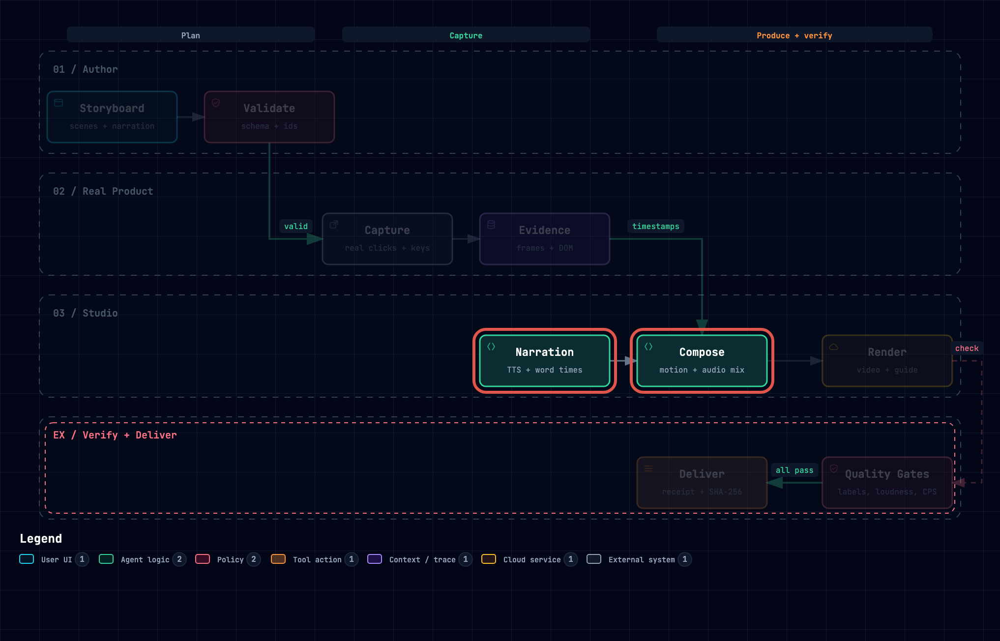

<h1 align="center">How It Works</h1>
<h3 align="center">Tutorials that can't go stale.</h3>

<p align="center">
  <a href="https://junixlabs.github.io/how-it-works/"></a>
  <br />
  <sub><strong>▶ <a href="https://junixlabs.github.io/how-it-works/">Watch the 34-second launch video with sound</a></strong> · built from footage, narration, and diagrams that How It Works produced · <a href="docs/media/launch.mp4">MP4</a></sub>
</p>

<p align="center">
  <a href="https://github.com/junixlabs/how-it-works/actions/workflows/test.yml"></a>
  <a href="LICENSE"></a>
  <a href=".claude-plugin/plugin.json"></a>
  <a href="SKILL.md"></a>
</p>

Screenshots and screen recordings break the moment your UI changes. **How It Works** is a Claude Code plugin that writes one storyboard, clicks through your real product in a real browser, and delivers a step-by-step guide, GIFs, and narrated videos in wide and vertical. Every step is checked on the live page before anything ships. When the product changes, you run it again.

## Install

In Claude Code:

```text
/plugin marketplace add junixlabs/how-it-works
/plugin install how-it-works@how-it-works
/how-it-works:setup
```

Setup installs Chromium and the Kokoro voice once. The voice is about 1 GB and is cached in `~/.cache/how-it-works`, so plugin updates keep it. Use `/how-it-works:setup --no-tts` to skip the voice.

<details>
<summary>Other agents, or install from source</summary>

```bash
npx skills add junixlabs/how-it-works -g        # Cursor, Codex, OpenCode, and other agent-skill hosts
# or
git clone https://github.com/junixlabs/how-it-works ~/.claude/skills/how-it-works
node ~/.claude/skills/how-it-works/scripts/setup.mjs
```

</details>

## Try it

Send this to Claude Code:

```text
Use How It Works to make a tutorial for https://demo.playwright.dev/todomvc:
add two tasks, complete one, then filter to the completed list.
I want a guide with GIFs and a narrated video, wide and vertical.
```

Claude writes the storyboard, validates it, runs it on the real page, renders, checks every output, and hands you the files together with a receipt.

## What you get from one storyboard

<table>
  <tr>
    <td width="50%"></td>
    <td width="50%"></td>
  </tr>
  <tr>
    <td><strong>Guide + GIFs</strong><br />Markdown steps with annotated screenshots and a GIF per action. Every bold UI label is checked against the real page.</td>
    <td><strong>Narrated video, 16:9</strong><br />Voice-over, captions timed to each word, a camera that follows each click, and sound on every real interaction.</td>
  </tr>
  <tr>
    <td></td>
    <td></td>
  </tr>
  <tr>
    <td><strong>Vertical, 9:16</strong><br />The same run recut for Shorts, Reels, and TikTok. Nothing is re-recorded.</td>
    <td><strong>Architecture explainers</strong><br />An animated tour of an <a href="https://github.com/tt-a1i/archify">Archify</a> diagram, one focus area per scene.</td>
  </tr>
</table>

| Kind | Delivers |
|---|---|
| `task-tutorial` | Guide with GIFs, plus a narrated video |
| `feature-release` | Release notes, plus wide and vertical launch videos |
| `architecture-explainer` | Diagram tour video, plus a guide |

## Checked before it ships

1. **Validate:** the storyboard is checked against a typed schema. Every problem comes back with its path and a suggested fix.
2. **Capture:** a real Chromium browser performs each step and asserts each `expect`. Clicks, keystrokes, and target boxes are logged as evidence.
3. **Produce:** narration (Kokoro TTS), word-timed captions, camera moves on logged boxes, and SFX on real clicks. Rendered with [HyperFrames](https://github.com/heygen-com/hyperframes).
4. **Verify:** quality gates run on every output.
5. **Deliver:** outputs replace the previous delivery only when every gate passes. A `receipt.json` records SHA-256 hashes.

Here are the gates from the release example:

```text
PASS  guide: UI labels exist in product            3/3 labels
PASS  guide: gif covers action add-tasks           14.20s vs 11.88s
PASS  video-16x9: no black gaps                    none
PASS  video-16x9: loudness -14 LUFS ±2             -15.8 LUFS
PASS  video-16x9: caption speed add-tasks          15.2 chars/s
PASS  video-9x16: spec 1080x1920                   1080x1920 h264 30/1
...   29/29 passed
```

## CLI

The plugin drives this CLI for you. You can also run it directly:

```bash
hiw validate <storyboard.json> --json     # typed diagnostics with suggested fixes
hiw deliver  <storyboard.json> <out-dir>  # capture, render, gate, deliver atomically
hiw review   <out-dir>                    # contact sheets for a visual check
hiw doctor                                # what is installed and what is missing
hiw demo     <out-dir>                    # explainer of this pipeline (needs Archify)
```

`hiw` is `node bin/hiw.mjs`, and every command accepts `--json`. For storyboards, start from [`examples/`](examples/) and [`schemas/storyboard.schema.json`](schemas/storyboard.schema.json).

## Requirements

- Node.js 20 or later
- `ffmpeg` and `ffprobe` on your `PATH`
- Python 3.10 to 3.12 for the Kokoro voice (3.11 recommended). On macOS, `tts.engine: "say"` works without it.
- Optional: the [Archify](https://github.com/tt-a1i/archify) skill, for diagram scenes

## Music

No music track ships with this repository. Set `audio.music` to a track you are licensed to use; see [`assets/music/README.md`](assets/music/README.md). The sound effects are generated procedurally by `scripts/make-sfx.mjs` and have no license restrictions.

## Development

```bash
ARCHIFY_HOME=/path/to/archify/archify npm test
claude plugin validate .
```

## Credits

[Archify](https://github.com/tt-a1i/archify) (MIT) for diagrams · [HyperFrames](https://github.com/heygen-com/hyperframes) (Apache-2.0) for video rendering · [Kokoro-82M](https://huggingface.co/hexgrad/Kokoro-82M) (Apache-2.0) for speech · [Playwright](https://playwright.dev) (Apache-2.0) for capture · [GSAP](https://gsap.com) for animation.

## License

[MIT](LICENSE)
